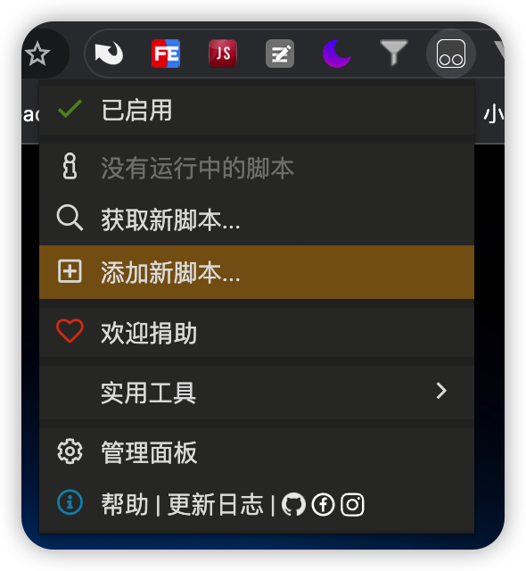
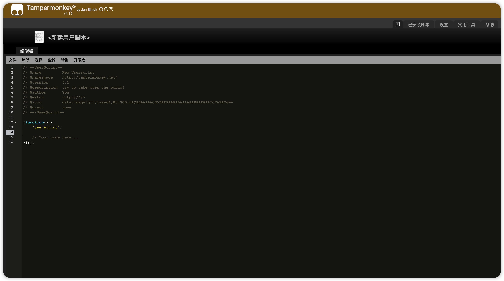
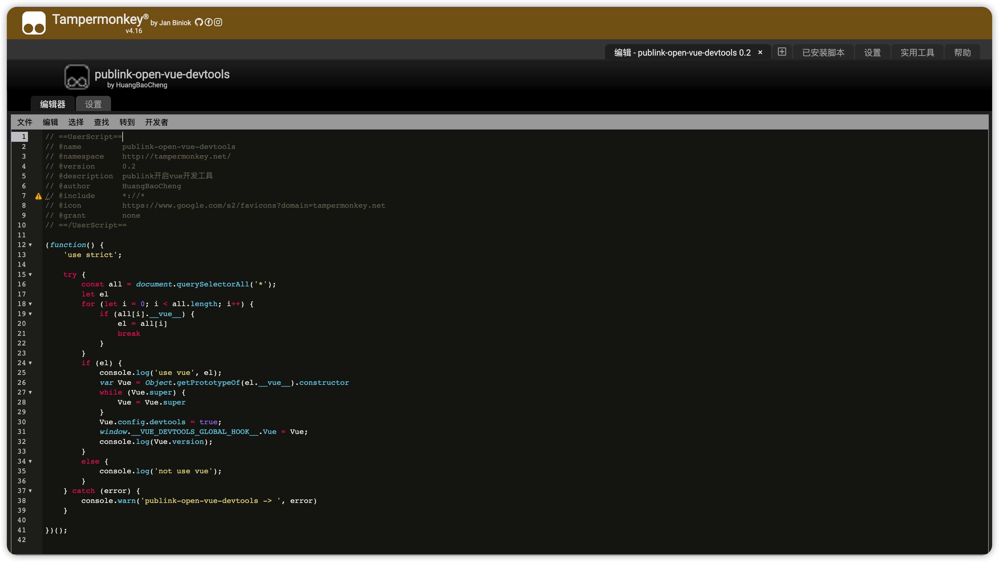
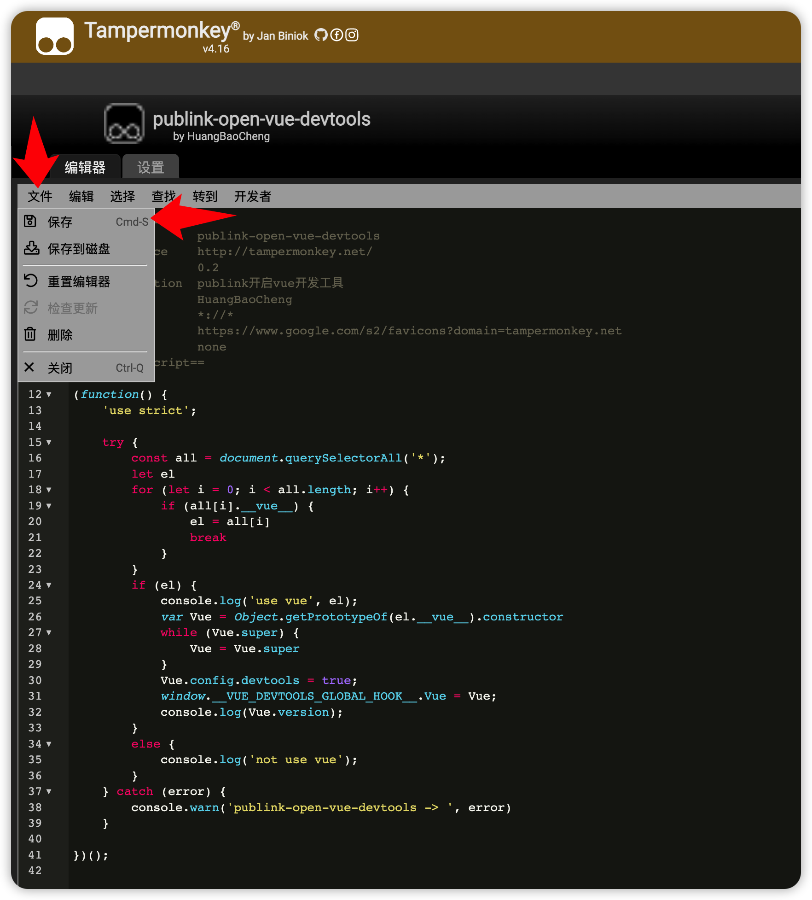
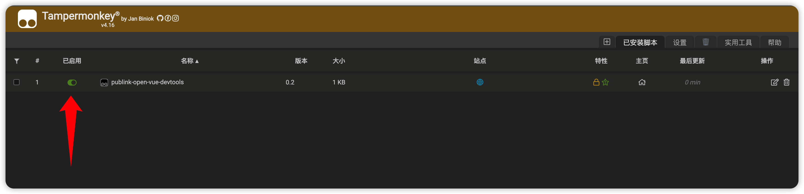
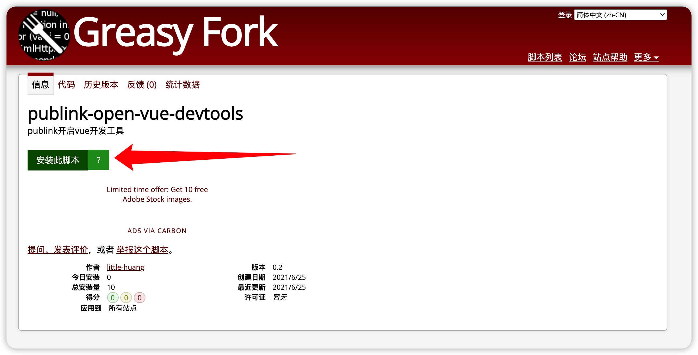
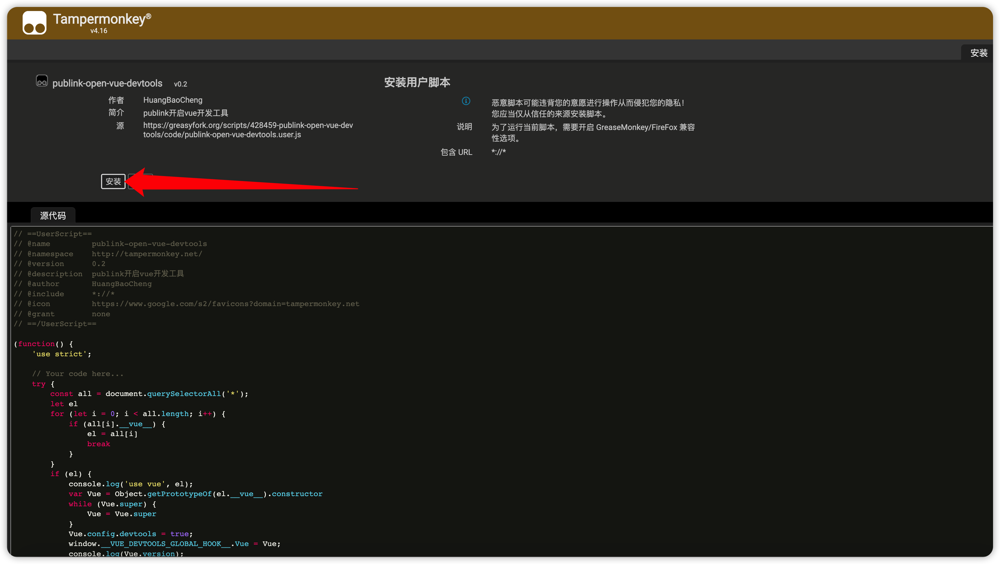
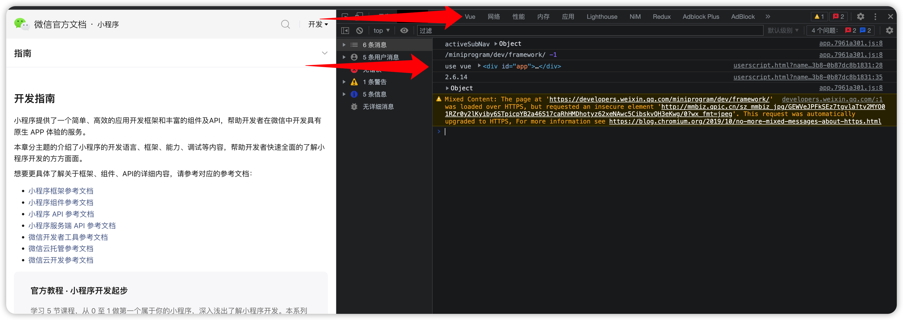
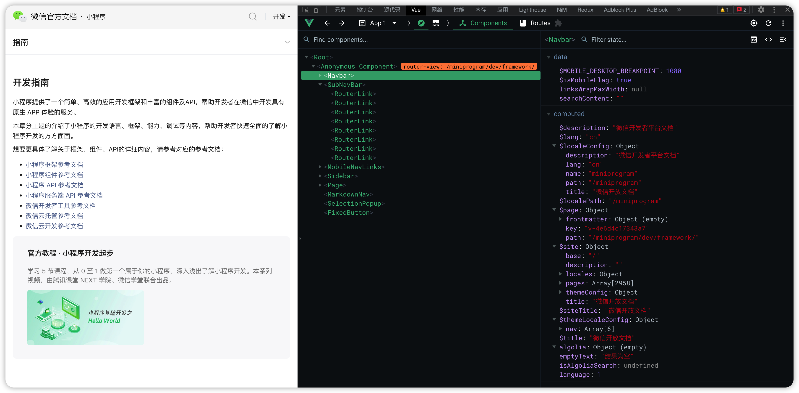

## Getting Started

要使用这个js，你需要安装 Tampermonkey 扩展和 Vue.js devtools 扩展。

[Tampermonkey - Chrome 网上应用店](https://chrome.google.com/webstore/detail/tampermonkey/dhdgffkkebhmkfjojejmpbldmpobfkfo)

[Vue.js devtools - Chrome 网上应用店](https://chrome.google.com/webstore/detail/vuejs-devtools/nhdogjmejiglipccpnnnanhbledajbpd)

## Installation
### 本地添加新脚本

1. 点击 Tampermonkey 扩展图标，选择添加新脚本。

2. 将编辑器内容清空，添加项目中根目录 index.js的内容到编辑器内。

3. 保存并开启

### 在线获取新脚本

[publink-open-vue-devtools](https://greasyfork.org/zh-CN/scripts/428459-publink-open-vue-devtools)

## Use

### 测试是否可用

打开微信开放文档网站，然后打开浏览器开发者工具。

[微信开放文档](https://developers.weixin.qq.com/miniprogram/dev/framework/)

